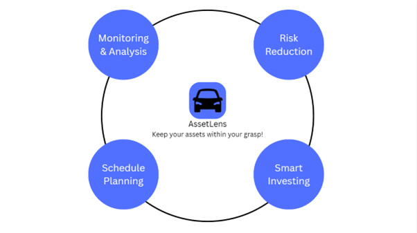

# AssetLens


**Real-time Asset Valuation for Smarter Financial Decisions**

**Team Members**:
  - Krutin Rathod
  - Nihar Patel

<video controls src="demo.mp4" title="Title"></video>

**Event**: Quackathon (Hackathon)

**Video Demo**: [Watch Here](https://youtu.be/nVz9G9w6lmM?si=b1DoFpRMh63ZaNbr)


Two computer science graduates walked into a fintech hackathon with zero financial market experience. What they built next might surprise you.

## The Challenge We Tackled

**"Expanding Loan Access Through Smarter Asset Collateralization"**

Traditional lending is broken. Manual appraisals are slow, expensive, and exclude millions from accessing credit. We decided to fix this by building an autonomous asset assessment system that evaluates real-time market values for both traditional and non-traditional collateral.

## What AssetLens Does

AssetLens transforms how you understand your assets' worth. Whether it's your car, your land, or that vintage collection gathering dust, we provide **instant, accurate valuations** that reflect current market conditions.



### Core Features

**Vehicle Valuation Engine**

- Real-time market data integration via MarketCheck API
- Comprehensive analysis: Make, Model, Year, Mileage, Location
- True Market Value calculations for trade-in, private party, and retail scenarios
- Instant loan-to-value ratio assessments

**Land Assessment System**

- Property valuation using Regrid API integration
- Tax assessment data and market comparisons
- Geographic intelligence with Google Places integration
- Comprehensive property analysis reports

**Smart Portfolio Management**

- Multi-asset tracking dashboard
- Google OAuth secure authentication
- Historical value tracking and trends
- Professional PDF report generation

## The Technical Foundation

Built for speed, scale, and reliability:

- **Frontend**: React 18 + TypeScript with Tailwind CSS
- **Backend**: Express.js with robust API architecture
- **Database**: SQLite with Drizzle ORM for lightning-fast queries
- **Authentication**: Google OAuth 2.0 integration
- **APIs**: MarketCheck (vehicles) + Regrid (property) + Google Places
- **Deployment**: Optimized for modern cloud infrastructure

## Why This Matters

**For Lenders**: Instant, accurate collateral assessment reduces processing time from days to minutes.

**For Borrowers**: Real-time asset valuations unlock credit opportunities previously inaccessible.

**For Asset Owners**: Stay informed about your wealth with continuous market monitoring.

## Getting Started

```bash
# Clone the repository
git clone https://github.com/Krut-in/AssetLens.git

# Install dependencies
cd AssetLens
npm install

# Set up environment variables
cp .env.example .env
# Add your API keys for MarketCheck, Regrid, and Google services

# Launch the application
npm run dev
```

Visit `http://localhost:8080` and start exploring your assets' true potential.

## The Hackathon Journey

What started as an ambitious challenge between two graduate engineers evolved into a comprehensive fintech solution. With no prior financial market knowledge, we dove deep into asset valuation methodologies, API integrations, and user experience design.

**The result?** A production-ready application that addresses real market needs while maintaining enterprise-grade security and performance standards.

## Future Roadmap

- **AI-Powered Predictions**: Machine learning models for asset value forecasting
- **Expanded Asset Classes**: Artwork, collectibles, and cryptocurrency integration
- **Institutional Features**: Bulk assessment tools for financial institutions
- **Mobile Application**: Native iOS and Android experiences

## Contributing

We believe in open innovation. Contributions, issues, and feature requests are welcome.

## License

This project is licensed under the MIT License - see the [LICENSE](LICENSE) file for details.

---

_Built with passion during a fintech hackathon. Powered by curiosity and countless cups of coffee._
